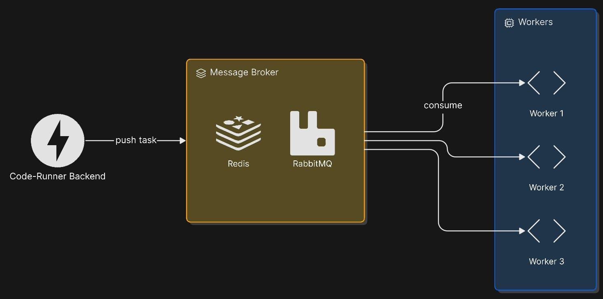

# **XsSandreiSsX Dev Journal**

## Patch 1.0:
I started this project because I’m planning to build projects such as an educational platform and a Codeforces-like website. I would also like to try connecting two services together. I also really wanted to work with such an amazing framework as FastAPI and get hands-on experience with it.

I also want to build workers that will run user submissions. This will be my first time working with tools like Celery, and honestly, I’m a little nervous about the final result

I’m also very interested in implementing a system for testing user submissions and taking protection against malicious code seriously.

### Planned Features
- Add database support
- Implement JWT authentication
- Create routers for managing test case system
- Add Celery workers for running user submissions 
- Implement submission queue processing 
- Add sandbox protection for malicious code


## Patch 1.1:
### Changelog
Added an environment file containing the basic project configuration.

Added a very important parameter: `DEBUG=True`. If it is enabled, the project uses a local SQLite database; otherwise, it uses PostgreSQL.

Right now, I’m following the idea that different services will use the code-runner and send user code for testing.

Because of this, I created a `Service` table where we can add services and automatically generate a random `jwt_secret`. This secret will be used by third-party services when sending requests to the code-runner as a small security measure. I will improve this logic further soon.

At the moment, I implemented CLI access for convenient service creation/removal, though I may change this approach in the future.

I also added custom exceptions that should help prevent accidental bugs on my side, but they should not affect the client side in any way. To this end I want to create separate `ClientExceptions`.

### Future Features:
- I’m planning to implement JWT authorization logic. 
- Add several endpoints for creating, deleting, and maybe updating test suites. 
- I will also add separate client-side exceptions.
- I’m planning to add corresponding database models for test suites, test cases, and related entities


## Patch 1.2: 
The core idea of the code-runner is that it should not know the problem title, for example “Add a+b”.
It also should not store submission history.

The code-runner should work like this:

“Here is the user solution.”
“Okay, I see it, I run the tests and return the result.”

That is where its logic ends. Of course, we also should not forget about time and memory limits.

A platform _like Codeforces_, on the other hand, stores submissions, attempt history, and the actual problem title.

Right now, I see it like this:
a ```test_suite``` is created inside the code-runner, and the website receives its id.

After that, when the user submits code, it sends something like ```/submit/```.
This means the code-runner stores the tests internally, and only the user solution is sent during submissions.

I also considered another approach where both the user solution and the entire test suite are sent in a single endpoint request.

However, let’s imagine an average problem with around 50 tests, and for example, a list containing 10^5 elements where ai <= 10^9.

That would be a huge amount of data transferred repeatedly, especially considering that a user may make multiple submission attempts after getting Wrong Answer.

### Changelog
Added a Pydantic `ClientResponse` schema to make responses from the code-runner consistent.

Added new models:
- `TestCase` — a model for a single test case.
- `TestSuite` — a model for a test suite.

`TestSuite` has a one-to-many relationship with `TestCase`.

Currently, we have:
- `time_limit`
- `memory_limit`
- a list of test cases

Added 4 endpoints:
- create a test suite
- get a test suite
- delete a test suite
- update a test suite

Also added several client-side exceptions and an `error_handler`, which guarantees that responses are returned in a consistent style.

Just look at how clean these endpoints are. I moved the business logic out of the endpoints into a separate class.

### Future Features
- Added a relationship between <code>TestSuite</code> and services, so each service only has access to its own test suites
- Planning to finish JWT authorization and use it to protect all API methods
- Added access control checks:
  - <code>service_id</code> from JWT must match the owner of the <code>TestSuite</code>
  - services cannot get, update, or delete others test suites


## Patch 1.3:
### Changelog
- While coding, I decided to try Poetry — such a cool thing for developers.  
  You can run everything with a virtual environment using a single command.  
  No more raw pip management!

- Finally added a one-to-many relationship between `Service` and `TestSuite`.

- Finally, I implemented JWT authorization.  
  JWT is actually a really cool thing — connected authentication through JWT Bearer in headers, everything as it should be.

- Added a couple of custom exceptions:
  - `UnauthorizedError`
  - `InvalidTokenError`

- Now services have access only to their own created `TestSuite`.

### Future Features
- Now it is time to create the `Submission` model.

- The model will be used for submitting user code.

- Again, why should the code-runner know when the submission was sent or who sent it?  
  The code-runner should only know the user code and which `TestSuite` it has to run.

- Additionally, the `Submission` model will store:
  - execution time
  - memory usage
  - status: `in_queue`, `running`, `completed`
  - verdict

- Also need to configure an endpoint that will submit user code.
## Patch 1.4:

### Changelog
- Added a new `Submission` model with the most essential fields:
  - which test suite will be used for testing
  - which service submitted the solution
  - submission status
  - verdict
  - failed test index if the verdict is `WRONG_ANSWER`
  - execution time and memory usage

- Added several new Pydantic schemas related to Submission, as well as corresponding endpoints:
  - **POST** `/submission` — submit user code for testing, after submission the status is automatically set to IN_QUEUE
  - **GET** `/submission/{submission_id}` — get the current submission status and verdict

- Added a `JudgeService` class as a temporary placeholder to handle background processing using FastAPI background tasks.

### Future Features
The “easy” part is over — now it’s time for the most interesting stage: working with user code execution and seriously thinking about server protection.
Honestly, this is the exact reason why I originally planned the code-runner project.

**In the next patch:**
- I plan to run user code inside containers and execute test cases.
- After that, I will focus on protecting the system kernel from malicious code and research different sandboxing/security approaches.
- I will also implement proper `Submission` status handling after code execution.

**Future plans:**
Later, I will integrate Celery for `Submission` queue management.

## Patch 1.5

While working on the protection layer, I ran into a lot of problems.

- One of the biggest issues was that `nsjail` itself runs inside an already restricted Docker container. Because of that, the Docker container had to be given quite a lot of permissions, but as a result, the protection inside `nsjail` became much stronger.
- Then I faced another problem: the isolated environment is started from scratch for every test, and the startup itself takes some time. Because of that, calculating the real execution time of the user's solution was pretty tricky.
So, physics knowledge came to the rescue. I decided to write `sleep(0.1)` in the code and use it as the time of an “ideal solution”. After that, I ran 1000 tests with empty input and output. Thanks to this, I was able to calculate the container startup time — around 25 ms, with an error of about ±4 ms, which is actually a very good result!

**After that, I decided to test the system in more realistic conditions. I ran a complex recursive DFS algorithm on 100 tests, and the whole check took only 1.8 seconds! Honestly, I was really happy with this result, because with this level of isolation I expected the overhead to be much higher.**

At the very beginning, when this project was only in the planning stage, I was thinking about the following protection methods:

- The first thing that came to my mind was detecting dangerous patterns in the user's code, for example `os.remove("system32")`. But if a person has even basic Python knowledge, this can be bypassed way too easily.
- The next step was to run user code inside a Docker container. This is already a completely different level compared to the first option: escaping becomes harder, but still possible. The second problem is that starting a Docker container takes too long.
- The solution was to use the ultra-fast and lightweight `nsjail`.

### Changelog

Let's start with the fact that in previous patches I forgot to add input data to `TestCase`. It's so funny because I didn't notice it at all until I started implementing the test execution logic.

- Added an input data field to the models and Pydantic schemas.

Now I finally have a clear vision of the future architecture of the project:



The diagram shows the main server, the broker, the workers, and the interaction between them:

- The main server manages the database, accepts requests, and so on.
- The workers, in turn, are responsible for running user code and processing the result.
- The broker manages the task queue. The main server does not need to know every worker directly — it only needs to know the broker. The same applies to the workers.

For isolating user code, I use an open-source application called `nsjail`. It is a utility that basically squeezes everything possible out of the Linux kernel.

- A new isolated environment is created for every single test, so the user cannot get access to information about all tests at once.
- A separate network namespace is created so the user cannot access the internet.
- A separate user namespace is created. Inside the jail, the user thinks they are root, but outside of it, they are just a regular user.
- A separate mount namespace is created. In practice, we define the working space as `worker/sandbox/rootfs`, but inside the jail it becomes `/`, the root directory, and escaping from it becomes very difficult.
- The container can only see its own processes, not the host processes.
- A separate cgroup is created, and system resources are limited very strictly, trust me.
- To run Python, all required files are copied into `rootfs` in advance: the interpreter, the standard library, and system dependencies. They are not mounted directly from the host while user code is running.
- A full `/proc` is not mounted inside the jail, because it can expose unnecessary information about the system. Instead, the environment is minimized, and the required environment variables are set explicitly.
- Also, for every solution, a separate folder with a unique UUID is created and mounted as `/workspace/`. The user cannot access someone else's ID in any way.

I will not go too deep into resource limitations, but with `cgroupv2`, things are really strict:

- File write size is limited. The user does not need to write files at all, but Python itself may do it in some cases.
- The number of simultaneously running processes is also heavily limited. The user will not be able to blow me up with `multiprocessing`.
Why not just 1 process? Because Python can theoretically spawn background processes.
- The isolated environment has access to only 1 CPU core.
- There is a soft memory limit that helps detect memory limit violations.
- There is a hard memory limit: if the isolated environment exceeds the limit, Linux kills the process with `SIGKILL`.
- There is also a time limit.


I also thought about this case in advance: what if the `time_limit` for a solution is set to 1 second, the solution itself theoretically runs in 0.1 seconds, but malicious code contains `sleep(0.9)`? To solve this problem, I added a total time limit for checking all tests.

The entire filesystem inside the jail is Read Only.
 `nsjail` also allows setting up `seccomp`. This is a really powerful thing: in short, it allows or blocks specific system calls at the Linux kernel level. But this requires more time to properly reduce the available capabilities, so I have not worked on it yet.

Even if malicious user code somehow manages to break through the protection I prepared, it will only end up on the worker server.

- The worker has no access to the database.
- The worker does not contain any secret resources.
- In theory, the worker can be rebuilt every day as another layer of protection.

Now let's look at what changed in the root folder of the project:

- `/app` contains the FastAPI application, endpoints, and related files.
- `/worker` contains only the files needed for the worker that runs user code.
- `/shared` contains shared schemas and enums, so the code is not duplicated inside `app` and `worker`.
- Added a `Dockerfile` that uses a multi-stage build. This is very convenient because `app` and `worker` can be built separately.
- Added `docker-compose.yaml` for building the full code-runner, although it does not fully build the entire project yet.

Additional changes:

- `/worker/debugtools.py` — functions for debugging the container, which helped me solve the problem of calculating the real execution time of user code.
- `/shared/logger.py` — I only started writing the logging foundation there, and I will finish it in future patches.
- I also started slowly adding documentation and comments to the code.

### Future Features

Before the first version is finished, there are only a few things left to add:

- Connect the application and workers using Celery and a message broker.
- Add at least basic logging.
- Write documentation for classes and functions as the final touch.

I am really glad that the project is getting close to completion! It was very interesting to work on the protection layer and learn about Linux namespaces. Of course, I did not go super deep under the hood, but I at least became familiar with the basic concepts.

Before this, I used to think Docker was some kind of miracle thing. Turns out Docker is basically just a convenient wrapper around Linux kernel features, and its authors did a great job making it lightweight and easy for everyone to use.

Also, I might study ways to visually display statistics and logging, and then use that in this project.


## DID YOU SAY STAIRS?

Only 2 days left until AURA MONSTER, 2 days until Daniel's party!

## Patch 1.6
At some point, I ran into a problem: we send a `Submission` to the worker so it can run the code and execute the tests. At first, everything seemed fine — we had removed synchronous code from the FastAPI application.

But then an annoying detail appears: we still need to get the execution result somehow.

My first thought was to use the simplest approach: the worker processes the `Submission` and writes the result back to the database by itself. That would be ideal — the application would just send the task to the worker and stop caring about the rest.

But in my case, this is not the best option. The worker runs user-submitted code, and giving that process direct access to the database is almost suicidal. Even with isolation, I still do not want the potentially dangerous part of the system to be able to touch the main database.

So instead of writing the execution result directly to the database, I store it through `Redis` as the Celery result backend. This allows the worker to return the result without having access to the main database.

Of course, this does not make the system completely invulnerable. If malicious user code somehow escapes the worker isolation, it can still try to cause damage through the queue: for example, break task processing, corrupt task results, or assign fake verdicts like `WRONG_ANSWER` to other `Submission` tasks.

So `Redis` solves the specific problem of not giving the worker direct access to the main database, but it does not remove the need to protect the queue and the result backend as well. It simply reduces the blast radius compared to giving the worker full database access.

In Celery, we can get the result by `task_id` using `AsyncResult().get()`. The problem is that `.get()` is a blocking method. It waits until the task is completed, and if we call it directly inside FastAPI, we bring back the same blocking behavior we were trying to avoid.


I see a few possible solutions:
- Create a webhook where the worker sends the judging result.

I do not like this solution by itself. It adds an unnecessary extra layer and also requires storing a secret token, which could be stolen if malicious code escapes the isolation.
- **Update the verdict only when GET /submission/{submission_id} is called.**

This sounds better, but I still do not like it. If nobody requests the submission, it can stay as status.RUNNING forever and become dead weight in the database. There is also a chance of a race condition.

- **After submitting a solution, create a new thread that waits for the task result.**

I do not like this solution either. A lot of submissions means a lot of threads. Also, if the FastAPI application crashes, some submissions may stay as status.RUNNING forever.

- **Create one background checker that runs every 1–2 seconds.**

For now, this feels like the best solution. The checker will live inside the FastAPI lifespan, find submissions with status.RUNNING, ask Redis for the Celery task result, and update the verdict when the task is finished.

This way, we do not create a separate thread for every submission, the worker still does not need database access, and RUNNING submissions can be picked up automatically after a restart.

After comparing these options, I decided to use a background checker.

For this, I need to add a celery_task_id field to the Submission model. I will save the Celery task id when the submission is created, and the checker will use it to fetch the task result and update the final verdict.

### Changelog
- Added `the celery_task_id` field to the Submission model
- Added PostgreSQL database to docker-compose
- Added RabbitMQ message broker to docker-compose
- Added Redis to docker-compose for storing worker task results
- The connection between the main service and the worker now works through the RabbitMQ message broker
- The task queue now works correctly: tasks are sent, the worker receives them, and user code is executed
- Added `ResultAwaiter` for receiving worker results and updating the Submission status
- In the CLI, the `add-service` command can now optionally generate a test Bearer token valid for 15 minutes
- Previously, stdin and stdout were limited to 10,000 characters, but this turned out to be too small for real-world usage, so these limits were removed
- Tested the full flow of the task queue, worker execution, and result retrieval through Redis
- Made minor improvements to the DAO layer: added the `get_many_or_none` method and removed duplicated code
- **Celery finally works properly. Victory.**

### Future Features
- Add basic logging to make the behavior of the API, worker, and result processing easier to debug
- Improve the project documentation, including setup instructions and a clearer explanation of the architecture
- Add seed problems to quickly test the full workflow with predefined problems, test cases, and submissions

## Patch 1.7:

The project has reached an important completed stage. I really enjoyed working on it: experimenting with `nsjail`, setting up isolated code execution, building the task queue, and getting hands-on experience with Celery, RabbitMQ, Redis backend, and the infrastructure around asynchronous judging.

This patch is focused on making the project easier to test, debug, document, and maintain.

### Changelog

- Added seed problems for quick creation of test `TestSuite` records.
- Added a dedicated seed problem structure:

  - `meta.py` — problem metadata;
  - `tests.json` — test cases;
  - `solutions.py` — predefined solutions with expected verdicts.
- Added loading of seed problems from the project file structure.
- Added support for loading only selected seed problem fields.
- Added the ability to insert a selected seed problem into a specific service as a `TestSuite`.
- Added validation for missing seed problems before insertion. 
- Added validation for missing services before inserting a seed `TestSuite`.
- Added CLI command for listing all available seed problems.
- Added CLI command for viewing seed problem metadata:
  - title;
  - statement;
  - input format;
  - output format;
  - time limit;
  - memory limit.
- Added CLI command for inserting a seed problem into the database.
- Added `--to-service` option for selecting the target service.
- Added `judge-test` CLI command for full judge pipeline verification.
- `judge-test` creates a temporary service for testing.
- `judge-test` inserts a seed `TestSuite` into the temporary service.
- `judge-test` submits all predefined solutions from `solutions.py`.
- `judge-test` compares actual verdicts with expected verdicts.
- `judge-test` removes all temporary data after the check is finished.
- Added `CheckResult` for storing individual check results.
- Added Rich-based live terminal UI for displaying judge test progress.
- Added success, failure, and error output for judge checks.
- Added handling for errors raised by individual checks.
- Added helper for waiting for Celery task results without blocking the event loop.
- Moved blocking Celery backend calls to a separate thread using `asyncio.to_thread`.
- Added integration/smoke test coverage for the full flow:

  - FastAPI backend;
  - Celery;
  - RabbitMQ;
  - worker;
  - Redis result backend;
  - database update.
- Added docstrings across the main parts of the project:

  - CLI commands;
  - service layer;
  - DAO layer;
  - FastAPI dependencies;
  - `ResultAwaiter`;
  - worker runner;
  - worker use cases;

- Added basic project logging.
- Added loggers to important parts of the application.
- Standardized logger usage with `logger = logging.getLogger(__name__)`.
- Reduced noisy logs during large test runs.
- Updated logs to use structured `key=value` style where useful.
- Added safe DAO debug logs without logging sensitive payload values.
- Added `ResultAwaiter` logs for startup, shutdown, task result processing, and errors.
- Added logs for sending submissions to Celery.
- Added runner debug logs for temporary workspace creation, sandbox execution, and cleanup.
- Avoided logging sensitive or large values such as `source_code`, `jwt_secret`, and full test cases.
- Improved CLI command descriptions using `help` and `short_help`.
- Improved CLI error messages for missing services and seed problems.

### Future Features
 - **Added README.md before release.**